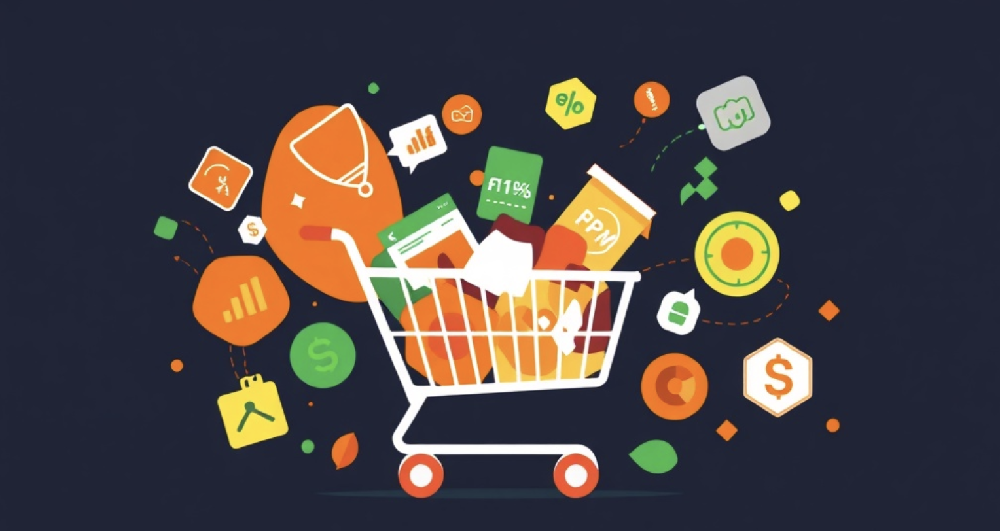
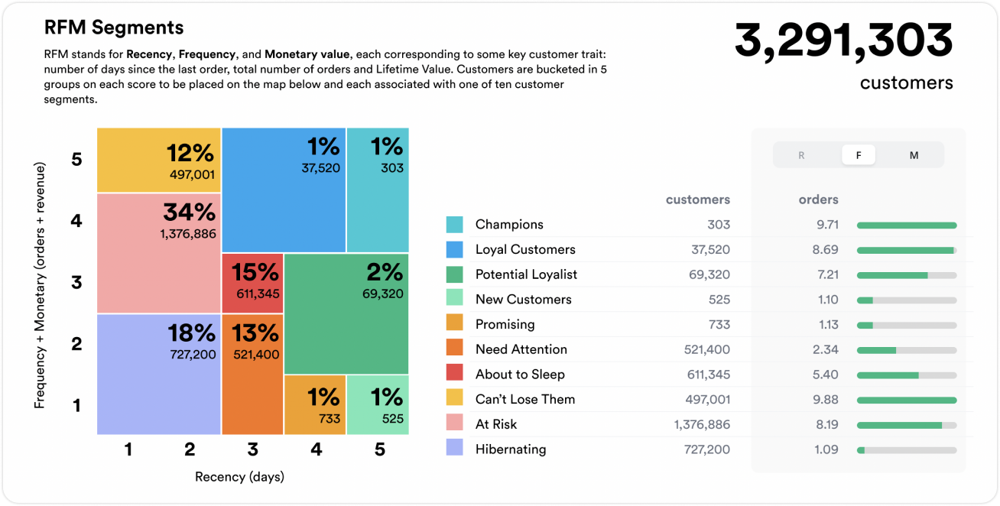
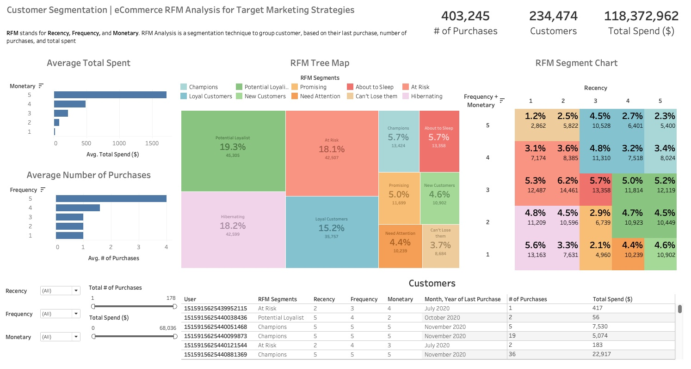

## eCommerce Customer Segmentation

    

    <a href="#Problem Statement">Problem Statement</a> •
    <a href="#Dataset">Dataset</a> •
    <a href="#EDA">EDA</a> •
    <a href="#Data Cleaning & Transformation">Data Cleaning & Transformation</a> •
    <a href="#Data Visualisation">Data Visualisation</a> •
    <a href="#Executive Summary">Executive Summary</a> •
    <a href="#Recommendations">Recommendations</a> •
    <a href="#Extensions">Extensions</a>

## Problem Statement

The goal of this project is to categorise customers of an eCommerce website into distinct segments using RFM (Recency, 
Frequency, Monetary) analysis. By identifying these segments, targeted marketing strategies can be created to 
enhance customer engagement and ultimately improve sales performance. 

## RFM Analysis
RFM analysis is a marketing technique used to identify and segment customers based on 3 key metrics:

- <b>Recency (R)</b>: Measures how recently a customer made their last purchase
- <b>Frequency (F)</b>: Tracks how often a customer makes purchases within a specific timeframe
- <b>Monetary (M)</b>: Assesses the total amount of money a customer spends

By analysing these three metrics, businesses can classify customers into distinct segments (like "Champions," "At Risk," 
and "New Customers") and tailor marketing strategies accordingly. This enables the business to improve 
customer retention and drive sales growth.

Example image of RFM Segments dashboard by [John Abbasi](https://www.peelinsights.com/post/what-is-rfm-analysis)

## Dataset
The <i>eCommerce purchase history from electronics store dataset</i> from [Kaggle](https://www.kaggle.com/datasets/mkechinov/ecommerce-purchase-history-from-electronics-store)
is used for this project. The dataset was transformed into a SQLite database with the following fields:

- `event_time`: The date & time the event occurred in yyyy-MM-dd HH:mm:ss UTC format
- `order_id`: Order ID
- `product_id`: Product ID
- `category_id`: Product category ID
- `category_code`: Name for given category (if present)
- `brand`: Brand name
- `price`: Product price
- `user_id`: User ID associated with event

## EDA

### Key Findings:
- The dataset extends until 2020-11-21. However, it contains a significant number of purchases from 1970-01-01, this is
likely some form of error as the only years present in the dataset are 2020 and 1970
- `user` and `price` contained null values, indicating missing data. This data 
encompasses 16% of the total rows
- 1,637,398 of `user_id` contained an empty string, which equated to 62% the total rows. This required further investigation as
this was a significant proportion of the dataset
- All `price` values that were null also had null `user_id` values. It was discovered these records'
`category_code` and `brand` fields contained the `price` and `user_id` values for these records respectively
- 1,198,255 rows had duplicate `order_id` values. If a `order_id` was duplicated, it indicates that the user purchased
multiple products in a single order

Full description of EDA can be found in [EDA.sql](https://github.com/ejml1/eCommerce-Customer-Segmentation/blob/master/EDA.sql)

## Data Cleaning & Transformation

To create the RFM model, the dataset was cleaned and transformed.

The transformed dataset contains the following fields:

- `user`: Corresponds to `user_id`
- `last_purchase`: The date in yyyy-MM-dd format of `user`'s last purchase
- `num_purchase`: The total times the user has ordered from the website
- `total_spend`: The total amount ($) the user has spent on the website
- `recency_percentile`: Score out of 5 based on how recent the `user` has purchased from the website
- `frequency_percentile`: Score out of 5 based on how many times the `user` has purchased from the website
- `monetary_percentile`: Score out of 5 based the total amount the `user` has spent on the website

Data cleaning summary:

- Only purchase from the year 2020 were included to avoid skewing the recency percentile scores
- The null `price` and `user_id` values that were misplaced in the `category_code` and `brand` fields were
corrected
- Empty string `user_id`s were not included as they could not be assigned scores
- As empty string `user_id`s were not included, a large proportion of the dataset was deemed unusable

## Data Visualisation

A dashboard on Tableau was created to visualise the data. [Link to live dashboard](https://public.tableau.com/app/profile/ethan.li1866/viz/eCommerceSegmentation/Dashboard1?publish=yes&showOnboarding=true)

## Executive Summary
- In 2020, the website has driven over 234,474 unique customers who have collectively purchased a total of 403,245 times
and spent $118,372,962.
- The top 20 percentile of highest paying customers (Monetary score of 5), on average, spent \$1,719. This is 3.5x more than the
next 20 percentile as this group spent an average of \$485.
- The most frequent customers made 4 purchases in 2020 while the lower 80th percentile purchased an average of just 1-1.6 times.
- The highest value customers with an RFM score of 5,5,5; 5,5,4; or 5,5,3 are in the <b>Champions</b> segment. This equates 
to 13,424 customers or 5.7% of our total users. Collectively, this group of customers have ordered 43,446 times, which equates
to 10.8% of the sites total purchases. In terms of total spent, this equates to $18,505,684, or 15.6% of the sites total sales.
- <b>Loyal Customers</b> are the next most valued customers, making up a total of 15.2% of total customers. This is the
4th largest segment as their segment covers a wider range of RFM scores. This segment purchased a total of $48,483,112 
over 114,226 orders. This is significant as it equates to 41.0% of the sites total sales across 28.3% of the total purchases.
This means that despite <b>Champions</b> and <b>Loyal Customers</b> making up only 20.9% of the site's users, they derive 
51.8% of the sites total sales.
- Customers who have a high monetary value but have not purchased recently are placed in the <b>Can't Lose Them</b> and <b>At Risk</b> segments. 
Combined, they make up 21.8% of the site's customers.
- Regarding the frequency score, the average number of purchases for the lower 3 buckets are all 1. This means the 
customers may not well-segmented, as customers with only 1 purchase can be arbitrarily placed in any of these 3 buckets.
This may reduce the effectiveness of the RFM model in identifying distinct behavioral patterns and customer value within certain segments.

## Recommendations
- Given the limitation regarding the frequency segmentation, it may be best to focus on the segments which have a
frequency + monetary score of 4+ as users with a frequency score in the 1-3 range exhibit the same behaviour. 
This means segments other than <b>Champions</b>, <b>Loyal Customers</b>, <b>Can't Lose Them</b>, and
<b>At Risk</b> may be arbitrary and not useful.
- As <b>Champions</b> and <b>Loyal Customers</b> make up a majority of the sites total sales, it is important to keep
these customers engaged. Consider trialing a loyalty program that offers exclusive discounts or special offers
to encourage repeat purchases. 
- For the <b>Can't Lose Them</b> and <b>At Risk</b> segments, introducing limited-time discounts can serve as an 
effective strategy for re-engagement. While these offers could potentially reduce margins in the short term, 
the long-term value of reactivating high-value customers may be far more significant for the company’s overall performance. 
By encouraging these customers to return, we can foster loyalty and ultimately increase their lifetime value, 
making the investment worthwhile in the broader context of customer retention and revenue growth.
- To assess the effectiveness of these strategies, A/B testing can be employed to compare responses from different 
customer segments. For the <b>Champions</b> and <b>Loyal Customers</b>, trialing a loyalty program with exclusive discounts or 
offers can be tested against a control group that does not receive these incentives. This can determine the impact 
on repeat purchases and engagement. 
- Similarly, limited-time discounts for the <b>Can't Lose Them</b> and <b>At Risk</b> segments
can be analysed through A/B testing, where one group receives the discounts while another group does not. 
By carefully measuring metrics such as conversion rates, customer reactivation, and overall sales performance, 
we can draw insights regarding the long-term value these strategies bring, ensuring that our approach not only engages customers effectively but also aligns with the profitability goals of the website.

## Extensions
To enhance this project further, implementing clustering techniques using Python can be a valuable 
extension. By applying algorithms such as K-Means, more nuanced customer 
segments can be created beyond the existing RFM scores. These techniques will allow patterns and group customers to be identified
based on their purchasing behaviour, preferences, and interactions with the brand, allowing for a more granular analysis.